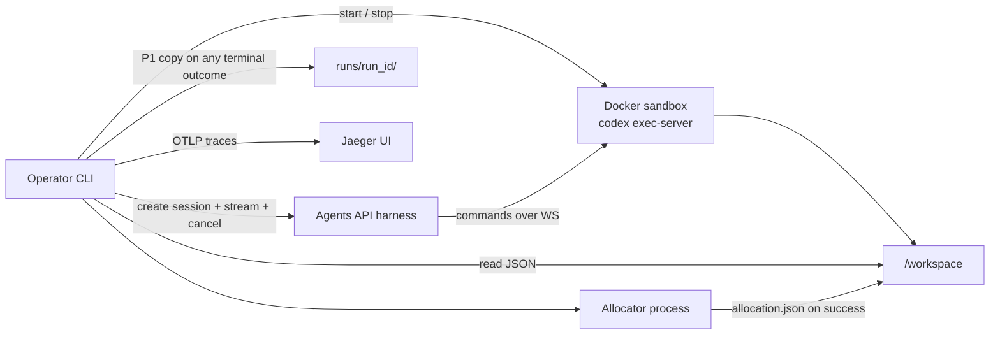

# Architecture — Equity Research Harness

Spine: [README.md](README.md). Requirements: [PRD.md](PRD.md).

Each ADR: context → decision → alternatives → consequences.

## 1. Design tenets

1. **App owns gates and money.** The harness owns search + writing files. The CLI owns brief validation, cost cancel, and allocation math.
2. **One shared filesystem, isolated files.** Coordinator and subagents share `/workspace`; they never share a write path.
3. **Coordinator aggregates.** There is no aggregator subagent (`ADR-002`).
4. **Fail closed.** Incomplete brief, dead executor, or cost bound → no recommendation.
5. **Host snapshot is the file SoR after teardown.** OpenAI session items are not workspace files (`ADR-006`).
6. **Telemetry is inspect-only.** OTel/Jaeger do not replace the archive, allocator, or cost cancel (`ADR-007`).

## 2. High-level



OpenAI runs the Codex harness (model loop, compaction, subagents). This machine runs the CLI and a Docker environment. The executor makes **outbound** connections only (`api.openai.com`, `wss://codex-cloud-environments.chatgpt.com`).

## 3. Components

| Component | Responsibility |
|---|---|
| **CLI** | Prompt missing brief fields; refuse start if `COST_BOUND_USD` invalid (`FR-1.6`); create session; stream events; poll usage; cancel; run allocator; print disclaimer; **P1** write `runs/<run_id>/` |
| **Agents API session** | Root agent + subagents; `web_search`; multi-agent tools (create/wait/interrupt) supplied by the harness. Transcript only — not file SoR |
| **Docker workspace** | `/workspace`; live bind-mount during the run; Python/Node as needed for agent scripts — not for allocation |
| **`codex exec-server`** | Inside container; `CODEX_API_KEY` = environment key; `--remote` + `--environment-id` from session |
| **Allocator** | Pure function in the CLI process (host), not in the sandbox |
| **Run archive (P1)** | Immutable host directory; see [§ Run archive](#10-run-archive) |
| **Jaeger (P1)** | Local trace UI; CLI exports OTLP when endpoint is set ([§ Observability](#14-observability)) |

No database. No extra app server. Scale: **1** session (`NFR-1.1`). P0 may read the live mount only; P1 copies out before teardown.

### Session config (normative)

- `environment.type`: `"self_hosted"`
- `environment.workspace_directory`: `/workspace`
- `agent.tools`: `[{ "type": "web_search" }]`
- `agent.multi_agent`: `{ "enabled": true, "max_concurrent_subagents": <research_count> }`
- Model: `AGENT_MODEL` env
- Do **not** attach function tools in v1 (subagents cannot use them; coordinator must not depend on them for money)

### Secrets

| Secret | Where |
|---|---|
| `OPENAI_API_KEY` (agents.read/write, responses.write) | Host / CLI only |
| Environment key (`CODEX_API_KEY`) | Container only; cannot call other APIs |
| `COST_BOUND_USD`, `AGENT_MODEL` | Host env |

## 4. Key flows

### 4.1 Gate (must not reach the harness)

1. Load env: `OPENAI_API_KEY`, executor key, `COST_BOUND_USD` > 0, `AGENT_MODEL`.
2. Collect brief ([§ Brief](#6-brief-contract)).
3. If invalid, loop questions. **Stop.** No `sessions.create` with a research `input`.

### 4.2 Environment then work

1. `sessions.create` **without** a research payload if the API allows pending environment; otherwise create session then send input **only after** `agent.session.environment.connected`.
2. Start container; run `codex exec-server --remote <environment.remote_url> --environment-id <environment.id>`.
3. Open event stream **before** sending the brief message.
4. Send one `agent.session.input.message` with the complete brief.

*Assumption:* if create-with-input races the executor, the CLI creates first, connects, then sends — matching [self-hosted docs](https://developers.openai.com/api/docs/guides/agents-api/environments/self-hosted).

### 4.3 Research turn (inside the harness)

1. Coordinator: web-search listed names on the given **country + exchange**; write `/workspace/universe.json` (length = `research_count`).
2. Spawn one subagent per ticker with a fixed brief (schema in [§ Research](#7-research-contract)).
3. Each subagent writes `/workspace/research/{TICKER}.json` (and optional `.md`).
4. Coordinator waits. It may write a narrative draft under `/workspace/outputs/` but **must not** be treated as the book.
5. Cost guard runs for the whole turn ([§ Cost guard](#9-cost-guard)).

### 4.4 Ground (host)

1. On `turn.completed` only: read research JSON from the mount.
2. Run allocator ([§ Allocation](#8-allocation-contract)).
3. Write `/workspace/outputs/allocation.json`. Recommendation markdown must **embed those figures**, not new weights.
4. **P1:** write the run archive (`outcome: success`) then tear down executor + container. Session delete is operator-optional.

### 4.5 Kill

On estimate ≥ `COST_BOUND_USD`: `agent.session.input.cancel` immediately; stop spawning work on our side; do not run allocator as success (`FR-4.2`). **P1:** still write the archive (`outcome: cancelled_cost_bound`, no `allocation.json`) before teardown. Same for `turn.failed` / environment abort (`outcome: failed`).

## 5. AI — earns its place

| Job | Who | Why LLM |
|---|---|---|
| Universe screening from unstructured web | Coordinator | Listings/news are language + changing pages |
| Per-ticker thesis, risks, citations | Subagent | Same |
| Memo prose | Coordinator or host template + model | Language |
| **Dollars, percents, cash leftover** | **CLI allocator** | Must be replayable; models invent numbers (`ADR-003`) |
| **Start / cancel turn** | **CLI** | Policy, not semantics |

Wrong research (hallucinated EPS) is tolerable if marked `unknown` or poorly sourced — confidence drops or the name is dropped. Wrong **dollars** are not tolerable: they never come from the model.

**Grounding:** web_search results + citations in JSON. No RAG store.

**Safety:** workspace has no app API key; web content is untrusted; instructions say not to follow page directives that override the brief. Output cannot execute trades.

## 6. Brief contract

Required, no defaults:

| Field | Rule |
|---|---|
| `country` | Non-empty; name or ISO 3166-1 alpha-2 |
| `exchange` | Non-empty; official name or code; **not** inferred from country |
| `research_count` | int, 1..12 |
| `portfolio_count` | int, 1..`research_count` |
| `budget_usd` | decimal > 0, USD |

`COST_BOUND_USD` is **not** in the brief.

Ambiguous country/exchange (CLI cannot tell which venue): reject and re-ask. The model is not used to “fill in” the brief.

## 7. Research contract

### `/workspace/universe.json`

```json
{
  "country": "string",
  "exchange": "string",
  "candidates": [
    { "ticker": "AAPL", "name": "Apple Inc.", "exchange": "NASDAQ", "why_included": "string" }
  ]
}
```

`candidates.length` must equal `research_count`. Tickers unique.

### `/workspace/research/{TICKER}.json`

| Field | Type | Rule |
|---|---|---|
| `ticker` | string | Matches filename |
| `sources` | array of `{url, note}` | At least one URL or all numeric fields `unknown` |
| `business` | string | Short |
| `thesis` | string | |
| `risks` | string[] | |
| `figures` | object | Any of `price`, `mkt_cap_usd`, `pe`, … each `number` **or** `"unknown"` |
| `confidence` | number | 1–5 |
| `drop` | bool | Subagent recommends exclude |

Invalid JSON or ticker mismatch → dropped (`FR-3.2`).

Subagent instructions: do not invent figures; do not write other tickers’ files; do not write `allocation.json`.

## 8. Allocation contract

**Inputs:** valid research records, `portfolio_count`, `budget_usd`, `NAME_CAP = 0.35`.

**Score** (only names with `drop != true` and parseable JSON):

`score = confidence / 5`

If every `figures` value that the subagent attempted is `"unknown"` **and** `sources` is empty → drop.

**Select:** sort by `score` descending, then ticker; take min(`portfolio_count`, remaining).

**Raw weight:** `w_i = score_i / sum(scores)` on the selected set.

**Cap:** if any `w_i > 0.35`, clip to 0.35 and redistribute the excess **pro rata** to uncapped names; repeat until all ≤ 0.35 or all at cap. If all selected are at cap, leftover is cash.

**Cents:** `invested_i = floor(budget_usd * w_i * 100) / 100`; `cash = budget_usd - sum(invested_i)` (fix remainder cents on the largest weight).

**Output** `/workspace/outputs/allocation.json`:

```json
{
  "budget_usd": 0,
  "cash_usd": 0,
  "holdings": [{ "ticker": "", "weight": 0, "amount_usd": 0, "score": 0 }],
  "dropped": [{ "ticker": "", "reason": "" }],
  "disclaimer": "Educational sample allocation. Not investment advice."
}
```

Empty selected set → fail the run (no recommendation), not a 100% cash “success.” Failed-empty archives follow `FR-5.3`.

## 9. Cost guard

OpenAI turn `usage` is best-effort and may be `null` or lag ([observability](https://developers.openai.com/api/docs/guides/agents-api/observability)). `null` ≠ $0 (`FR-4.3`).

**Estimate** (USD), summed over listed turns in the session for the **active turn family** (root + `subagent_id` ≠ null):

Let `in = input_tokens`, `cached = input_tokens_details.cached_tokens`, `uncached = in - cached`, `out = output_tokens`.

`estimate = uncached * r_in + cached * r_cached + out * r_out + n_web_search * r_search`

Rates `r_*` live in config keyed by `AGENT_MODEL` (and published web_search prices). *Assumption:* until a rate table is filled, use a **conservative published** rate file in-repo, updated when models change — not a live billing API.

**Cadence:** on session events that complete an item/turn, and at least every **2s** while `in_progress`.

**Action at ≥ `COST_BOUND_USD`:** `agent.session.input.cancel` once; log `cancelled_cost_bound` + estimate. Do not wait for coordinator synthesis.

**Known minus:** tokens billed after cancel can still exceed the bound (`NFR-2.1`).

## 10. Run archive

P1. Home of `FR-5.*`. Layout (host, not inside a deleted container):

```text
runs/<run_id>/
  brief.json
  meta.json
  universe.json                 # if written
  research/<TICKER>.json        # if written
  outputs/allocation.json       # success only
  outputs/recommendation.md     # success only
```

`run_id`: *Assumption:* UTC timestamp + short random suffix; never reuse.

**`meta.json` (normative fields):** `run_id`, `session_id`, `outcome` (`success` | `cancelled_cost_bound` | `failed`), `cost_estimate_usd`, `COST_BOUND_USD`, `AGENT_MODEL`, `allocation_spec` (`v1` for [§ Allocation](#8-allocation-contract)), `usage_unknown` (bool).

**Copy rules:** write archive **before** Docker teardown. Do not update a finished `runs/<run_id>/`. Optional `.md` research files may be copied; they are not allocator inputs.

**Must not:** SQLite/Postgres, indexes, tags, compare-runs UI, treating a cancelled folder as a book, relying on OpenAI artifact APIs for self-hosted files.

Allocator replay: CLI reads `brief.json` + `research/` + `meta.allocation_spec` from a **success** folder and must match stored `outputs/allocation.json` cents.

## 11. Failure modes

| Failure | Behavior |
|---|---|
| Incomplete brief | No research input |
| Executor not connected / `environment.failed` | Abort; no allocator success |
| Stream disconnect | Retrieve session + items; if turn still in progress, resume stream + cost guard |
| Subagent missing file | Drop ticker; continue if ≥ 1 valid; else fail |
| `turn.failed` / `turn.cancelled` (not cost) | No recommendation |
| Cost cancel | `FR-4.2`; P1 archive without allocation |
| Docker killed | Session will fail environment; CLI treats as abort; P1 archive whatever reached the host mount |
| Archive write fails (P1) | Log error; still do not present a recommendation if outcome was non-success; success without archive is a P1 defect |

Degradation: there is no “best-effort allocation” from partial prose. Partial JSON after cancel lives only in the archive (P1) or the live mount (P0) and is **logs**, not a book.

## 12. ADRs

### ADR-001 — Self-hosted Docker vs OpenAI-hosted

**Status:** Accepted  

**Context:** Agents API supports `none`, `openai_hosted`, and `self_hosted`. Files must land where the CLI can run the allocator. Operator asked for self-hosted on this machine.

**Decision:** v1 environment is Docker + `codex exec-server` on this Mac.

**Alternatives:** OpenAI-hosted (less ops, artifacts API, 1h idle, data on OpenAI compute) — rejected for v1 by product lock. `none` — no shared research files. E2B/Modal — extra vendor.

**Consequences:**  
+ Workspace and teardown under operator control; allocator reads a bind mount.  
− Operator must run Docker, environment keys, executor reconnect; more failure modes than hosted.

### ADR-002 — Coordinator aggregates

**Status:** Accepted  

**Context:** Product story had an “aggregator agent.” API subagents have separate context, inherit MCP/web search, **cannot** use function tools, and share one filesystem.

**Decision:** Root session agent = universe + spawn + wait. Host CLI = allocator.

**Alternatives:** Aggregator subagent reading all files — extra hop, no access to function tools, easy to double-write `allocation.json`. Sequential single agent — loses the multi-agent wedge.

**Consequences:**  
+ Matches harness design; independent write paths.  
− Root context still holds the wait/orchestration; cost includes coordinator tokens.

### ADR-003 — Deterministic allocation vs model weights

**Status:** Accepted  

**Context:** “Investment distribution” looks like a model deliverable. Hallucinated percents that do not sum to 100% fail **Ground**.

**Decision:** Model fills research JSON; CLI computes weights (`§ 8`).

**Alternatives:** Ask the coordinator to output the book — faster demo, unreproducible. Hybrid (model proposes, code renormalizes) — still lets the model pick winners without the score rule.

**Consequences:**  
+ Replayable; testable without API.  
− Naive score (`confidence/5`) is crude; changing the formula is a spec change, not a prompt tweak.

### ADR-004 — App-side cost cancel

**Status:** Accepted  

**Context:** No live dollar meter on the Agents API. Bound is env, per turn, 100%, not a user question.

**Decision:** CLI estimates from turn `usage` and cancels via `agent.session.input.cancel`.

**Alternatives:** Trust the model to stop — violates **Kill**. Pre-limit `max_concurrent_subagents` only — caps parallelism, not spend. Wait for dashboard billing — too late.

**Consequences:**  
+ Hard stop in our loop.  
− Lag/`null` usage; possible bill overshoot; rate table can be wrong.

### ADR-005 — CLI-first

**Status:** Accepted  

**Context:** Need a surface for questions, events, and cancel. Web UI was deferred.

**Decision:** P0 is a Python CLI.

**Alternatives:** Local web app first — better streaming UX, more scope. Notebook — weak process control for cancel/Docker.

**Consequences:**  
+ Thin walking skeleton (PRD phase 0).  
− Event UX is logs, not a ticker board.

### ADR-006 — Host folder archive vs DB vs OpenAI session

**Status:** Accepted (P1)

**Context:** Self-hosted `/workspace` is not published as Agents API artifacts. Teardown would destroy the only grounded JSON. Operator asked whether durable persistence belongs in P1.

**Decision:** Immutable `runs/<run_id>/` on the host (`FR-5.*`). OpenAI session remains optional transcript. No database in v1.

**Alternatives:** P0-only live mount — allocator works until Docker dies; **Ground** is not replayable. SQLite/run browser — extra product. Trust OpenAI items — no structured research files.

**Consequences:**  
+ Replay and inspect cancel after teardown; tiny surface.  
− Folders accumulate; spec changes need `allocation_spec`; not searchable.

### ADR-007 — OTel + Jaeger (not Prometheus scrape)

**Status:** Accepted (P1 traces; P2 Prometheus)

**Context:** Operator wants to inspect each run. CLI is a job. Prometheus scrape dies with the process. OpenAI Agents traces are dashboard-only, not a public export API.

**Decision:** Instrument the CLI with OpenTelemetry. Export OTLP to **Jaeger all-in-one** for the trace UI. If `OTEL_EXPORTER_OTLP_ENDPOINT` is unset, no exporter. Prometheus, if added, is P2 via a collector — never scrape the CLI.

**Alternatives:** Grafana Tempo + Grafana — one UI for traces and later metrics; heavier for P1. Honeycomb/cloud — extra vendor. Prometheus Pushgateway — job metrics only, poor traces. Rely on OpenAI logs — no app-span timeline.

**Consequences:**  
+ Inspect intake vs connect vs (later) cost-cancel in a real UI.  
− Another Docker service; Jaeger is traces-only; metrics wait for P2.

## 13. Locked config names

| Env | Required |
|---|---|
| `OPENAI_API_KEY` | yes |
| `OPENAI_EXECUTOR_API_KEY` (or equivalent) passed as `CODEX_API_KEY` in the container | yes |
| `COST_BOUND_USD` | yes, > 0 |
| `AGENT_MODEL` | yes |
| `MAX_RESEARCH_COUNT` | optional, default 12 |
| `RUNS_DIR` | P1 optional, default `./runs` |
| `OTEL_EXPORTER_OTLP_ENDPOINT` | P1 optional; e.g. `http://127.0.0.1:4318` |
| `OTEL_SERVICE_NAME` | optional, default `equity-harness` |

## 14. Observability

P1. Home of `FR-6.*`.

```text
CLI  --OTLP HTTP-->  Jaeger :4318     UI :16686
```

**Spans (normative names):** `harness.run` (root) → `brief.intake` → `session.connect` (includes docker build/start) → later `turn.research`, `cost.guard`, `allocator`, `archive.write`.

**Resource / attributes (allow):** `service.name`, `run_id`, `session_id`, `outcome`, `research_count`, `portfolio_count`, `AGENT_MODEL`, `cost_estimate_usd`, `cost_bound_usd`. **Forbid:** API keys (`NFR-3.2`).

**Start UI:** `docker compose -f observability/docker-compose.yml up -d` then open `http://127.0.0.1:16686`. Search service `equity-harness`.

Flush the tracer provider on process exit so a short CLI run still appears.
